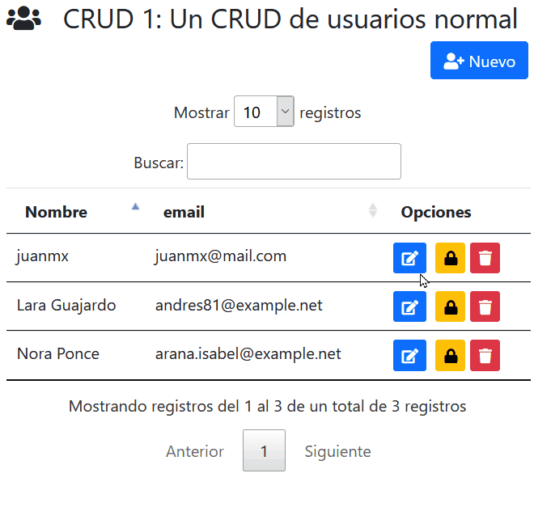

# Cruds en Laravel

Hecho en laravel y php 7

Tiene algunos estilos de CRUD que aprendí a hacer, la idea es crear un sistema pequeño pero muy completo y robusto.

Se agrega al listado de carpetas del `.gitignore` las siguientes carpetas del proyecto: `app`, `public/css` y `public/js` para evitar plagios (que ya ha pasado).

Este sistema sigue en desarrollo, pero se agregan imágenes demostrativas.

# Imágenes demostrativas para un CRUD de usuarios

# Crear usuario

# Editar usuario

# Bloquear/Desbloquear usuario

# Eliminar usuario

# Imágenes demostrativas para un CRUD de costos

# Datatables *details-control* y *server-side*

***Details-control*** es una capacidad de datatables de mostrar información adicional de una fila usando una fila hija.

***Server-side*** es recomendado de usar cuando se está trabajando con bases de datos con muchos registros. Con *server-side*, todas las acciones de paginación, búsqueda y ordenamiento que realiza datatables se transfieren al servidor. 

Con cada acción sobre la tabla que requiera modificarla (ordenar, buscar, paginar, u otros), dará como resultado una nueva solicitud Ajax para obtener los datos requeridos.

# Demostración de un CRUD de costos con datatables *details-control* y *server-side*

# Crear costo

# Editar costo

# Bloquear/Desbloquear costo

# Eliminar costo

Este sistema usa:
* Bootstrap
* Toastr
* SweetAlert2
* DataTables
* MySql
* Diseño responsive
* Font awesome
* Date range picker
* Moment JS
* Imask
* jQuery
